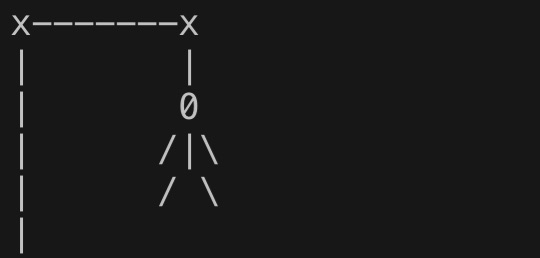

# Simulation of a program run

    
  
  

#
    Welcome to Hangman! A word will be chosen at random and you must try to guess the word correctly letter by letter before you run out of attempts. Good luck!
    There are 20 words in the file and the selected word is in the index 3 You need to guess a 8-letter word. You have 7 attempts If you're wrong
    __  __  __  __  __  __  __  __

# Loss Simulation:
    

    Guess a letter:q
    x-------x
    __  __  __  __  __  __  __  __

    Guess a letter:w
    x-------x
    |
    |
    |
    |
    |

    __  __  __  __  __  __  __  __

    Guess a letter:e
    x-------x
    |       |
    |       0
    |
    |
    |

    __  __  __  __  __  __  __  __

    Guess a letter:r
    x-------x
    |       |
    |       0
    |       |
    |
    |

    __  __  __  __  __  __  __  __

    Guess a letter:t
    x-------x
    |       |
    |       0
    |      /|\
    |
    |

    __  __  __  __  __  __  __  __

    Guess a letter:f
    x-------x
    |       |
    |       0
    |      /|\
    |      /
    |

    __  __  __  __  __  __  __  __

    Guess a letter:g
    x-------x
    |       |
    |       0
    |      /|\
    |      / \
    |
    You LOSE The Word Was : backpack
    End Game

 # Victory Simulation :

    Guess a letter:b
    b  __  __  __  __  __  __  __

    Guess a letter:a
    b  a  __  __  __  a  __  __

    Guess a letter:c
    b  a  c  __  __  a  c  __

    Guess a letter:k
    b  a  c  k  __  a  c  k

    Guess a letter:p
    Well done, you won !
    b  a  c  k  p  a  c  k

    :)
